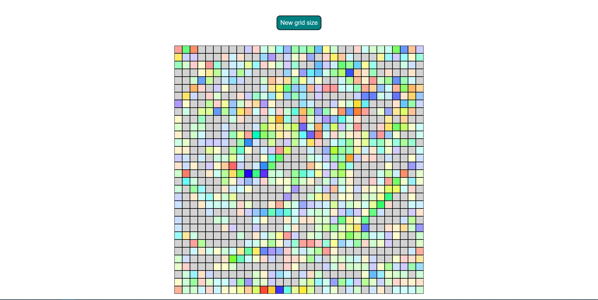

# Etch-a-sketch-type-of-something

## Table of contents

- [Overview](#overview)
  - [Screenshot](#screenshot)
- [My process](#my-process)
  - [Built with](#built-with)
  - [What I learned](#what-i-learned)

## Overview
This is a etch a sketch type of website where you can draw anything on the grid with the size you can choose

### Screenshot

### The page
Preview it live here: https://michaell0.github.io/Etch-a-sketch-type-of-something/

### Built with

- Semantic HTML5 markup
- CSS custom properties
- Flexbox
- Javascript

### What I learned
How to dynamically change website with Javascipt

